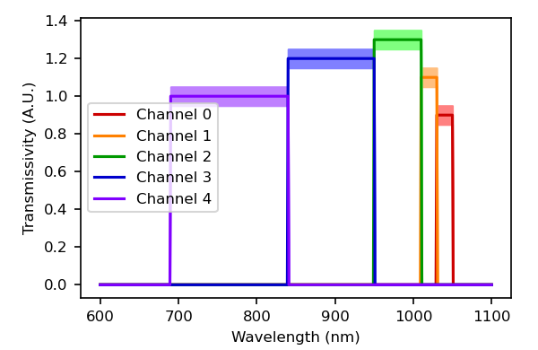
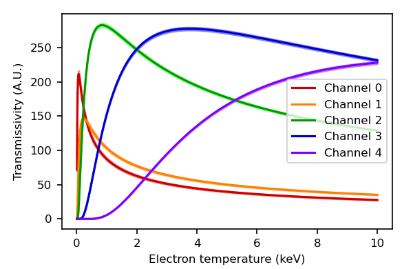
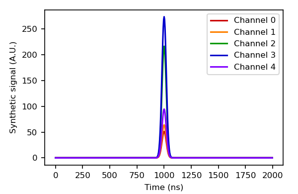

# Tutorial: the Polychromator class

This tutorial demonstrates the Polychromator object class (`polychromator.py`)
as well as basic usage of the functions `processPulse()` (`pulse_eval.py`) and
`fitSpectrum()` (`spectral_fitting.py`). 

A script that carries out the examples in this tutorial and generates the plots
is included in this directory as `tutorial_polychromator.py`.

## Prerequisites

The home directory of the repository must be added to your PYTHONPATH 
environment variable. The following libraries must be loaded:

    import numpy as np
    import pulse_eval as pe
    import spectral_fitting as sf
    import polychromator as pc

## Initializing the Polychromator class

It is possible to initialize an instance of the Polychromator class with no
arguments, but it is best to supply a laser wavelength and a scattering angle
to be associated with the incident beam and the polychromator's scattering
volume, respectively. The angle must be in radians; the laser wavelength can
be in any unit as long as all wavelength data are provided in consistent units.

    wvl_laser = 1064.
    scat_ang = 167.*np.pi/180.
    pcTest = pc.Polychromator(wvl_laser=wvl_laser, scat_ang=scat_ang)

## Adding transmissivity spectral data

After initialization, transmissivity spectra must be provided for each channel.
The transmissivity spectra may be supplied from experimental data
(`set_transmissivity_experimental()`) or as idealized flat-top filter 
response curves with defined pass-band levels, lower cutoffs, and upper cutoffs:

    n_channels = 5
    transm_levels = [0.9, 1.1, 1.3, 1.2, 1.0]
    cutoff_low    = [1030., 1010., 950., 840., 690.]
    cutoff_high   = [1050., 1030., 1010., 950., 840.]
    transm_errs   = [0.05, 0.05, 0.05, 0.05, 0.05]
    wvl = np.linspace(600, 1100, 501)
    pcTest.set_transmissivity_ideal(transm_levels, cutoff_low, cutoff_high, wvl, errs=transm_errs)

Note that the units of `wvl` must agree with those of `wvl_laser`.

The transmissivity spectra stored in the class instance may be extracted as
follows:

    transm = [[]]*n_channels
    dtransm = [[]]*n_channels
    wvl = [[]]*n_channels
    for i in range(n_channels):
        transm[i], dtransm[i], wvl[i] = pcTest.transmissivity(i)

## Spectra of expected relative polychromator signal levels

Once the laser wavelength, scattering angle, and transmissivity data are
supplied, the class will automatically integrate the transmissivity profiles
for each channel with the Thomson scattering spectra for a set of electron
temperature values. 

    spec, dspec, spec_te = pcTest.expected_relative_signal_spectra()

By default, the temperature values range from 0 to 10 keV in 10 eV increments, 
but this can also be set by the user as an optional argument (`spec_te`) when 
initializing the class.

## Generating synthetic signals

Synthetic scattered-light signals with Gaussian waveforms for a given 
temperature may be generated as follows:

    te_test = 3.0
    am_test = 1.0
    sigs, times = pcTest.synthetic_signals(te_test, am_test)

Here, `te_test` is the electron temperature (keV) associated with the synthetic
signals, and `am_test` is an arbitrary multiplying factor. The amplitudes of
the synthetic signals will be equal to `am_test` times the interpolated value 
of the expected relative signal (`spec`) for the respective channel.

It is also possible to add a component of random noise to each element of 
`sigs` through the optional argument `noise_std`.

## Evaluating the signals for spectral fitting

For a set of experimental polychromator signals to be evaluated for temperature
and density, they must first be processed to attain a single value representing
the signal strength from each channel of the polychromator. These signals
can be evaluated as follows:

    sigValsPk = [[]]*n_channels
    dSigValsPk = [[]]*n_channels
    info = [[]]*n_channels
    for i in range(n_channels):
        sigValsPk[i], dSigValsPk[i], info[i] = pe.processPulse(sigs[i], method='peak')

Note that the `'peak'` method of fitting was chosen; i.e., the values output
for each channel's signal are an estimate of the peak value, or pulse amplitude.

## Spectral fitting

Once the signal strength values are computed, they may be fit to the spectra
of expected relative signals to determine the electron temperature and 
density-dependent scaling factor:

    s0  = 2.0
    te0 = 2.0
    sigOK = [True]*n_channels
    sFit, teFit, dsFit, dteFit, chi2, _, _, _ = \
        sf.fitSpectrum(sigOK, sigValsPk, dSigValsPk, s0, te0, spec_te, spec, dspec, verbose=True)

Note that these synthetic signals fit perfectly to the Thomson spectrum 
and will not contain non-ideal features such as contributions from scattered
laser light that would need to be corrected for in experimental data.
The initial guess `s0` for the scaling factor may need to be adjusted depending
on the amplitudes of the transmissivity curves and of the input signals
themselves. Note that the input arguments `spec_te`, `spec`, and `dspec` were
generated above by the `expected_relative_signal_spectra()` method.

With the option `verbose=True`, a record of each iteration from the spectral
fitter will be printed to the screen:

    0: s =   2.000e+00; te =  2.000; chi2 =   1.168e+04
    1: s =   9.899e-01; te =  2.449; chi2 = 2.700981e+02; chi2_0 = 1.167989e+04
    2: s =   9.970e-01; te =  2.977; chi2 = 7.294564e-01; chi2_0 = 3.062976e+02
    3: s =   1.000e+00; te =  3.000; chi2 = 7.144377e-07; chi2_0 = 8.119899e-01

Note that the electron temperature has reached 3.0 keV, equal to `te_test` as
set above. The scaling factor `s` is found to be 1.0, equal to `am_test`. This
is to be expected if the signal strengths are calculated using the `'peak'`
method of `processPulse()`. However, if integration methods such as 
`'integrate'` or `'fit'` are chosen, the final value of `s` will depend on
the horizontal dimensions of the curve, which are specified in the keyword
arguments to `processPulse()`.

For example, suppose the `'fit'` method is employed with the default keyword 
arguments:

    sigValsFit = [[]]*n_channels
    dSigValsFit = [[]]*n_channels
    info = [[]]*n_channels
    for i in range(n_channels):
        sigValsFit[i], dSigValsFit[i], info[i] = pe.processPulse(sigs[i], method='fit')

    te0 = 2.0
    s0  = 2.0
    sigOK = [True]*n_channels
    sFit, teFit, dsFit, dteFit, chi2, _, _, _ = \
        sf.fitSpectrum(sigOK, sigValsFit, dSigValsFit, s0, te0, spec_te, spec, dspec, verbose=True)

In this case, the value of the scaling factor `s` is 3.133 (but the 
electron temperature is stil 3.0 keV):

    0: s =   2.000e+00; te =  2.000; chi2 =   2.565e+03
    1: s =   3.097e+00; te =  3.408; chi2 = 1.064912e+02; chi2_0 = 2.565334e+03
    2: s =   3.129e+00; te =  2.977; chi2 = 6.621338e-01; chi2_0 = 1.406805e+02
    3: s =   3.133e+00; te =  3.000; chi2 = 3.265707e-06; chi2_0 = 6.209596e-01

